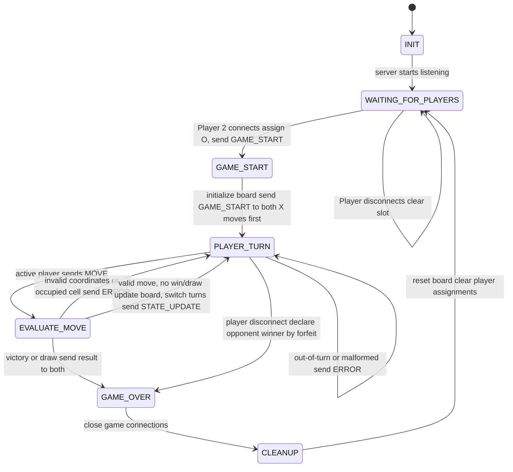

# Game State Machine

## States

### INIT

The server opens its TCP listening socket and starts with no players connected.

### WAITING_FOR_PLAYERS

The server waits for two players to join. The first player is assigned Player_1 and X, and receives LOBBY_WAIT. The second player is assigned Player_2 and O. If another client tries to join while both slots are taken, the server sends ERROR with ROOM_FULL and closes that client's connection.

### GAME_START

The server creates an empty board and sends GAME_START to both players. Player_1 goes first. If a connection is lost while the game is starting, the server goes to CLEANUP.

### PLAYER_TURN

The server waits for a MOVE from the player whose turn it is. If the other player sends a move, the server sends ERROR and keeps the same turn. If a message has incorrect or missing fields, the server sends ERROR without changing the board or turn.

### EVALUATE_MOVE

The server checks that the row and column are integers from 0–2 and that the cell is empty. If the move is invalid, the server sends ERROR and returns to PLAYER_TURN with the same player. If the move is valid, the server places the player's symbol and checks for a win or draw. Three matching symbols in a row, column, or diagonal wins. If there is no winner and every cell is filled, the game is a draw. If the game is still going, the server switches turns and sends STATE_UPDATE to both players.

### GAME_OVER

The server sends GAME_OVER with the final board, result, winner, and scores. No more moves are accepted.

### CLEANUP

The server closes the game connections, resets the board, and clears the player assignments. It then returns to WAITING_FOR_PLAYERS for another game.

## Disconnect Handling

If a player sends DISCONNECT, their connection returns `b""`, or a socket error or timeout occurs during the game, the other player wins by forfeit. The server sends GAME_OVER to the remaining player if their connection still works, then goes to CLEANUP. If Player_1 leaves before Player_2 joins, the server clears their slot and stays in WAITING_FOR_PLAYERS.