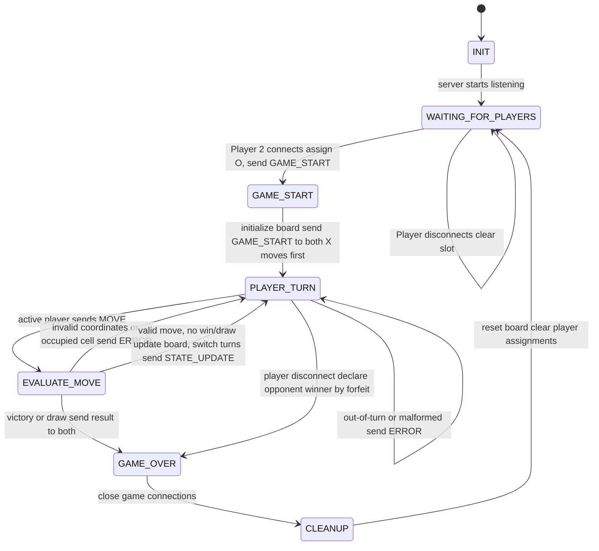

```mermaid
stateDiagram-v2
    [*] --> INIT
    INIT --> WAITING_FOR_PLAYERS: server starts listening
    
    WAITING_FOR_PLAYERS --> WAITING_FOR_PLAYERS: Player 1 connects assign X, send LOBBY_WAIT
    WAITING_FOR_PLAYERS --> WAITING_FOR_PLAYERS: Player disconnects clear slot
    WAITING_FOR_PLAYERS --> GAME_START: Player 2 connects assign O, send GAME_START
    
    GAME_START --> PLAYER_TURN: initialize board send GAME_START to both X moves first
    
    PLAYER_TURN --> EVALUATE_MOVE: active player sends MOVE
    PLAYER_TURN --> PLAYER_TURN: out-of-turn or malformed send ERROR
    
    EVALUATE_MOVE --> PLAYER_TURN: invalid coordinates or occupied cell send ERROR
    EVALUATE_MOVE --> PLAYER_TURN: valid move, no win/draw update board, switch turns send STATE_UPDATE
    EVALUATE_MOVE --> GAME_OVER: victory or draw send result to both
    
    PLAYER_TURN --> GAME_OVER: player disconnect declare opponent winner by forfeit
    
    GAME_OVER --> CLEANUP: close game connections
    CLEANUP --> WAITING_FOR_PLAYERS: reset board clear player assignments
```